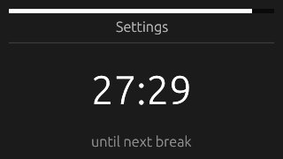

# 20³

A basic timer the 20-20-20 rule for reducing eye strain.

The 20-20-20 rule is where every 20 minutes, you look at something 20 feet away for 20 seconds.

This program also allows you to set custom durations.

## Download
Download the latest release <a href="releases/latest">from GitHub Releases</a>.
